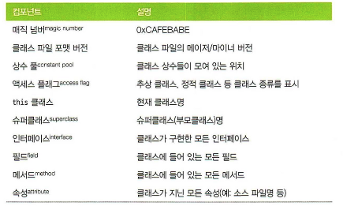

# **CHAPTER 2 JVM 이야기**

- 자바 가상 머신을 규정한 명세서(보통 VM 스펙이라고 함)에 따르면 JVM 은 스택 기반의 해석 머신이다. (물리적 CPU 하드웨어인) 레지스터는 없지만 일부 결과를 실행 스택에 보관하며, 이 스택의 맨 위에 쌓인 값들을 가져와 계산을 한다.
- JVM 인터프리터(해석기)의 기본 로직은, 평가 스택을 이용해 중간값들을 담아두고 가장 마지막에 실행된 명령어와 독립적으로 프로그램을 구성하는 옵코드(operation code:명령 코드 의 줄임말로, 기계어의 일부로서 수행할 명령어를 나타내는 부호)를 하나씩 순서대로 처리하는 ‘while 루프 안의 switch 문’이다.
- 자바 클래스로딩 메커니즘
    - 자바 프로세스가 새로 초기화되면 사슬처럼 줄지어 연결된 클래스로더가 차례차례 작동한다.
    - 제일 먼저 부트스트랩 클래스가  자바 런타임 코어 클래스를 로드한다.
        - 부트스트랩 클로스로더의 주임무는, 다른 클래스로더가 나머지 시스템에 필요한 클래스를 로드할 수 있게 최소한의 필수 클래스(예: java.lang.Object, Class, Classloader)만 로드하는 거다.
    - 그다음, 확장 클래스로더가 생긴다.
        - 확장 클래스로더를 이용하면 특정한 OS 나 플랫폼에 네이티브 코드를 제공하고 기본 환경을 오버라이드 할 수 있다.
    - 끝으로, 애플리케이션 클래스로더가 생성되고 지정된 클래스패스에 위치한 유저 클래스를 로드한다.
- 자바는 프로그램 실행 중 처음 보는 새 클래스를 **디펜던시**에 로드한다. 클래스를 찾지 못한 클래스로더는 기본적으로 자신의 부모 클래스로더에게 대신 룩업을 넘긴다. 이렇게 부모의 부모로 거슬러 올라가 결국 부트스트랩도 룩업하지 못하면 ClassNotFoundException 예외가 난다. 따라서 **나중에 뒤탈을 없애려면 빌드 프로세스 수립 시 운영 환경과 동일한 클래스패스로 컴파일하는 것이 좋다.**
- 바이트코드 실행
    - javac 가 하는 일은 자바 소스 코드를 바이트코드로 가득 찬 .class 파일로 바꾸는 것이다.
    - 클래스 파일 해부도
        - 모든 클래스 파일은 0xCAFEBABE 라는 매직 넘버, 즉 이 파일이 클래스 파일임을 나타내는 4바이트 16진수로 시작한다. 그 다음 4바이트는 클래스 파일을 컴파일할 때 꼭 필요한 메이저/마이너 버전 숫자이다.
        - 상수 풀에는 코드 곳곳에 등장하는 상숫값(예: 클래스명, 인터페이스명, 필드명 등)이 있다. JVM 은 코드를 실행할 때 런타임에 배치된 메모리 대신, 이 상수 풀 테이블을 찾아보고 필요한 값을 참조한다.

      

- 소스 코드를 빌드하면 플랫폼에 특정한 기계어로 컴파일된다. 이것을 사전(Ahead-Of-Time: AOT) 컴파일이라고 한다.
- 핫스팟은 프로그램의 런타임 동작을 분석하고 성능에 가장 유리한 방향으로 영리한 최적화를 적용하는 가상 머신이다. 핫스팟 VM 의 목표는 개발자가 억지로 VM 틀에 맞게 프로그램을 욱여넣는 대신, 자연스럽게 자바 코드를 작성하고 바람직한 설계 원리를 따르도록 하는 것이다.
- JIT 컴파일
    - 자바 프로그램은 바이트코드 인터프리터가 가상화한 스택 머신에서 명령어를 실행하며 시작 된다.
    - CPU 를 추상화한 구조라서 다른 플랫폼에서도 클래스 파일을 문제없이 실행할 수 있지만, 프로그램이 성능을 최대로 내려면 네이티브 기능을 활용해 CPU 에서 직접 프로그램을 실행시켜야 한다.
    - 이를 위해 핫스팟은 프로그램 단위(메서드와 루프)를 인터프리티드 바이트코드에서 네이티브 코드로 컴파일 한다. 바로 JIT(Just-In-Time) 컴파일이라고 알려진 기술이다.
    - 핫스팟은 인터프리티드 모드로 실행하는 동안 애플리케이션을 모니터링하면서 가장 자주 실행되는 코드 파트를 발견해 JIT 컴파일을 수행한다.
    - **JIT 방식으로 컴파일하면 여러모로 이점이 많다. 무엇보다 컴파일러가 해석 단계에서 수집한 추적 정보를 근거로 최적화를 결정한다는 게 가장 큰 장점이다.**
- 자바는 **가비지 수집(Garbage Collection)** 이라는 프로세스를 이용해 힙 메모리를 자동 관리하는 방식을 사용한다. 가비지 수집이란 한마디로, JVM 이 더 많은 메모리를 할당해야 할 때 불필요한 메모리를 회수하거나 재사용하는 불확정적 프로세스이다.
    - 일단 GC 가 실행되면 다른 애플리케이션은 모두 중단되고 하던 일을 멈춰야 한다. 이 중단 시간은 대개 아주 짧지만, 애플리케이션 부하가 늘수록 이 시간도 무시 할 수 없다.
- 자바의 멀티스레드 방식은 다음 세 가지 기본 설계 원칙에 기반한다.
    - 자바 프로세스의 모든 스레드는 가비지가 수집되는 하나의 공용 힙을 가진다.
    - 한 스레드가 생성한 객체는 그 객체를 참조하는 다른 스레드가 액세스 할 수 있다.
    - 기본적으로 객체는 변경 가능하다. 즉, 객체 필드에 할당된 값은 프로그래머가 애써 final 키워드로 불변 표시하지 않는 한 바뀔 수 있다.
- VisualVM
    - 넷빈즈 플랫폼 기반의 시각화 툴
    - 자바 9 부터는 주요 배포 파일에서 VisualVM 이 빠졌기 때문에 따로 바이너리 파일을 내려 받아야 한다.
    - VisualVM 을 처음 시작하면 자신이 실행되는 머신을 보정하는 과정을 거치므로 성능 보정에 영향을 줄 만한 다른 애플리케이션은 닫는 게 좋다.
    - VisualVM 은 다섯 가지 탭을 기본 제공한다.
        - 개요(Overview)
            - 자바 프로세스에 관한 요약 정보를 표시한다. 프로세스에 전달한 전체 플래그와 시스템 프로퍼티, 그리고 실행 중인 자바 버전도 정확히 나온다.
        - 모니터(Monitor)
            - Jconsole 뷰와 거의 비슷한 탭이다. CPU, 힙 사용량 등 JVM 을 고수준에서 원격 측정한 값들이 표시된다. 로드/언로드된 클래스 개수 및 실행중인 스레드 개수 등 현황도 알 수 있다.
        - 스레드(Thread)
            - 실행 중인 애플리케이션 각 스레드(애플리케이션 스레드 + VM 스레드)가 시간대별로 표시된다. 스레드별 상태와 짧은 변화 추이를 보면서 필요시 **스레드 덤프**를 뜰 수 있다.
        - 샘플러 및 프로파일러(Sample and Profiler)
            - CPU 및 메모리 사용률에 관한 단순 샘플링 결과가 표시